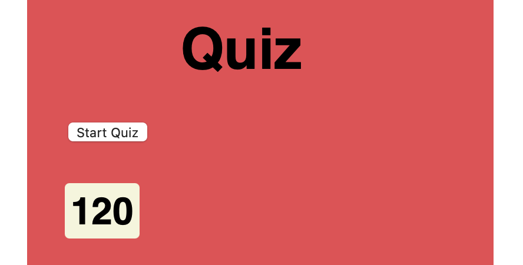
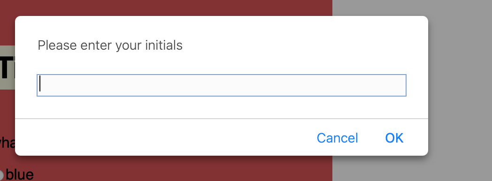

# Code Quiz

## Descripton

This repository contains a timed quiz including results of correct and wrong answers.

## Table of Contents
* [Contact](#contact)
* [Technologies](#technologies)  
* [Instructions](#instructions)

## Contact
Jenya Seletsky js646@me.com

## Technologies
  HTML
   CSS
   JavaScript

## Instructions
1. Click Start Quiz to begin quiz 

2. You will then see a timer start counting down (in secconds) 

3. Answer question presented
4. Click next for next question
5. If the answer is wrong, time will be subtracted by 20 seconds
6. When all questions are answered or the timer reaches 0 the quiz is over
7. When the quiz is over, enter your initials and click "Ok"

8. You will then see your quiz result in time and accracy of correct answers
9. To start the quiz again you will need to click "Start" 
